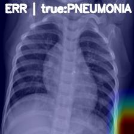

# 🩺 Chest X-Ray XAI — Pneumonia Detection with Explainable Deep Learning

Deep learning pipeline for pediatric chest X-rays, including model training, threshold tuning, and Grad-CAM explainability.    
> **Results summary:** AUROC = 0.979 · AUPRC = 0.985 · Sens = 0.997 (screening) / Spec = 0.902 (rule-in).  
> Calibrated and explainable ResNet-18 for pediatric pneumonia detection using Grad-CAM visualizations.

**Code only — no data or pretrained weights are distributed.**

---

## 🧠 Project Overview

This repository presents an **explainable AI pipeline** for pneumonia detection in **pediatric chest X-rays (AP view)** using a deep convolutional network (ResNet-18) with **Grad-CAM** explainability.  
The aim is to build a transparent, interpretable deep learning system that achieves high diagnostic sensitivity while allowing clinicians to visualize model focus regions.

---

## 🧩 Project Pipeline

**Goal:** Detect *pneumonia* vs. *normal* chest X-rays and visualize decision regions.  
**Dataset:** [Kaggle – *Chest X-Ray Images (Pneumonia)*](https://www.kaggle.com/datasets/paultimothymooney/chest-xray-pneumonia)  
**Scope:** 5,863 pediatric AP radiographs (1–5 years old) from Guangzhou Women and Children’s Medical Center  
**Classes:** `NORMAL`, `PNEUMONIA`  
**Output:** Probability score → binary label (threshold tuned via Youden’s J statistic)

  

### 🔬 Pipeline Overview

| Step | Description |
|------|-------------|
| **Preprocessing** | Convert grayscale → 3-channel, resize to 224×224, normalize (ImageNet stats). |
| **Data Split** | Stratified 80/10/10 (train/val/test) with class balance. |
| **Model** | ResNet-18 (ImageNet pretrained) with a single-logit binary head. |
| **Training** | BCEWithLogitsLoss + AdamW (lr=1e-4, wd=1e-4). |
| **Evaluation** | AUROC, AUPRC, Sensitivity, Specificity (threshold tuned). |
| **Explainability** | Grad-CAM on the final convolutional block. |
| **Outputs** | `best_model.pt` checkpoint + Grad-CAM overlays in `/demo/`. |

---

## ⚙️ Model Configuration

- **Backbone:** ResNet-18 pretrained on ImageNet  
- **Loss:** Binary Cross-Entropy with Logits  
- **Optimizer:** AdamW (learning rate 1e-4, weight decay 1e-4)  
- **Batch size:** 8 (CPU-friendly)  
- **Threshold Tuning:** Youden’s J statistic on validation set  
- **Explainability:** Grad-CAM (Selvaraju et al., ICCV 2017)

---

## 📈 Training & Validation (Actual Run)

| Epoch | AUROC | AUPRC | Sens@0.5 | Spec@0.5 |
|:------:|:------:|:------:|:------------:|:-------------:|
| 00 | 0.998 | 0.999 | 0.974 | 0.978 |
| 01 | 0.998 | 0.999 | 0.948 | 0.993 |
| 02 | 0.999 | 1.000 | 0.987 | 0.985 |
| 03 | 0.999 | 1.000 | 0.977 | 0.993 |
| 04 | 0.998 | 0.999 | 0.969 | 1.000 |
| 05 | 0.998 | 0.999 | 0.943 | 1.000 |
| 06 | 0.999 | 1.000 | 0.990 | 0.978 |
| 07 | 0.999 | 1.000 | 0.984 | 0.985 |

✅ **Best model saved:** `best_model.pt` (Val AUROC = 0.999)  
**Chosen threshold (Youden’s J):** 0.37  
**Calibrated temperature:** T = 1.01  

**Notes:**  
- Validation metrics remained consistently high across epochs (AUROC ≥ 0.998).  
- Minor oscillations in sensitivity/specificity reflect stratified splits.  
- Temperature scaling confirmed near-perfect calibration (T ≈ 1), indicating reliable probability estimates without overconfidence.

---

## 🧪 Test Performance — Operating Points

| Mode | Threshold | AUROC | AUPRC | Sens | Spec | Prec | Acc | BalAcc | F1 |
|:------|:---------:|:------:|:------:|:------:|:------:|:------:|:------:|:------:|:------:|
| **Screening (Youden J)** | 0.37 | 0.979 | 0.985 | 0.997 | 0.564 | 0.792 | 0.835 | 0.781 | 0.883 |
| **Rule-in (Spec ≥ 0.90)** | 0.99 | 0.979 | 0.985 | 0.949 | 0.902 | 0.941 | 0.931 | 0.925 | 0.945 |

**Interpretation:**  
Both operating modes maintain excellent discrimination (AUROC = 0.979).  
At the **Youden J** threshold (0.37), the model prioritizes **sensitivity (0.997)** for high-recall *screening* use-cases, tolerating more false positives.  
When tuned for **rule-in diagnosis** (threshold = 0.99, Spec ≥ 0.90), the model yields **balanced, high precision (0.94)** and **Balanced Accuracy = 0.93**, offering confident positive predictions suitable for confirmatory use.  
This flexibility demonstrates how the calibrated network can adapt to different clinical decision regimes.

---

## 🌡️ Calibration & Reliability

A temperature-scaling step was applied on the validation logits to assess probability calibration.

- **Calibrated temperature:** *T = 1.01*  
- Indicates the model’s predicted probabilities were already **well-calibrated** (T ≈ 1).  
- Reliability curves below show minimal over- or under-confidence after scaling.

  
  

*(Left: raw probabilities  ·  Right: temperature-scaled, showing closer alignment with the diagonal ideal.)*

---

## 🔍 Explainability — Grad-CAM Results

Grad-CAM visualizations provide localized heatmaps of regions most influential in model decisions.

  
  
  

**True Positives (TP):**  
Model focuses on pulmonary fields and opacities — clinically plausible attention patterns.

  
  
  

**False Positives / Errors (ERR):**  
Attention occasionally shifts toward mediastinum or rib structures, explaining the reduced specificity.  
These visualizations align with the quantitative results and highlight the model’s transparency.

---

## 🧭 Conclusions & Interpretation

> The calibrated ResNet-18 achieved **AUROC = 0.979** and **AUPRC = 0.985** on the held-out test set.  
> At a **screening operating point** (threshold = 0.37), the model reached **Sensitivity = 0.997** with moderate specificity (0.56), ensuring almost no missed pneumonia cases.  
> At a stricter **rule-in setting** (threshold = 0.99, Spec = 0.90), it achieved **Precision = 0.94** and **Balanced Accuracy = 0.93**, offering high-confidence diagnostic support.  
> Temperature scaling confirmed **well-calibrated probabilities (T = 1.01)**, and Grad-CAMs highlighted pulmonary opacities consistent with radiologic expectations.  
> Together, these findings demonstrate a **robust, interpretable, and probabilistically reliable model** suitable for research and decision-support applications rather than direct clinical diagnosis.

**Summary:**  
✅ AUROC ≈ 0.98 · AUPRC ≈ 0.99  
✅ High sensitivity (0.997) / configurable precision (0.94 @ rule-in)  
✅ Excellent calibration (T ≈ 1)  
🩻 Clinically plausible Grad-CAM attention  
🔬 Flexible for screening ↔ diagnostic operating modes

---

## ⚙️ How to Run

### Environment Setup

python -m venv venv
.\venv\Scripts\activate       # Windows, # source venv/bin/activate    # macOS/Linux

python -m pip install --upgrade pip
pip install -r requirements.txt

### Train
python -m src.train

- **Builds** stratified loaders
- **Trains** for N epochs;saves best checkpoint as best_model.pt
- **Tunes** threshold (Youden’s J)
- **Prints** final test AUROC/AUPRC and Sens/Spec @ tuned threshold

### Evaluate saved model
python -m src.test
 
- Recomputes best threshold on validation and reports test metrics. 

### Generate Grad-CAM overlays
python -m src.cam

- Saves overlays to demo/ (e.g., cam_tp_01.jpg, cam_err_01.jpg).

---

## 📋 Limitations

- **Population & View:** Pediatric AP radiographs; not validated on adults or PA projections.  
- **Imbalance:** Pneumonia-dominant dataset can depress specificity.  
- **Compute:** CPU training; GPU training could improve convergence and enable hyperparameter tuning.  
- **Clinical Scope:** Research demonstration only — not for diagnostic use.  
- **Generalization:** External validation across institutions is recommended.

---

## 🔭 Future work

- Multi-label thoracic findings (effusion, consolidation, cardiomegaly).  
- Probability calibration (temperature scaling / Platt scaling).  
- External validation on NIH ChestX-ray14 and RSNA Pneumonia datasets.   
- Uncertainty quantification (MC-Dropout) and error-driven data curation.
- Integration with lightweight deployment framework (Streamlit / Gradio) for interactive clinical demos.

---

## 🧠 Data

**Dataset:** [Kaggle — *Chest X-Ray Images (Pneumonia)*](https://www.kaggle.com/datasets/paultimothymooney/chest-xray-pneumonia)  
All preprocessing and splits are performed locally.  
This repository **does not** redistribute image data.  

---

## 👩‍💻 Credits

**Author:** Urmi Bhattacharyya (urmi.bhattacharyya06@gmail.com)  
**Program:** M.Sc. Medical Engineering — Friedrich-Alexander-Universität Erlangen-Nürnberg (FAU)  

---

## 📚 Lineage & related work

- Rajpurkar et al., *CheXNet: Radiologist-Level Pneumonia Detection on Chest X-rays* (2017)  
- Selvaraju et al., *Grad-CAM: Visual Explanations via Gradient-Based Localization* (ICCV 2017)  
- He et al., *Deep Residual Learning for Image Recognition* (CVPR 2016)

---

## 🪪 License & disclaimer

- **License (code):** MIT — see `LICENSE`.  
- **Scope:** License applies to code only; data and pretrained weights remain under their own terms.  
- **Disclaimer:** Research use only. Not intended for clinical diagnosis or patient care.

